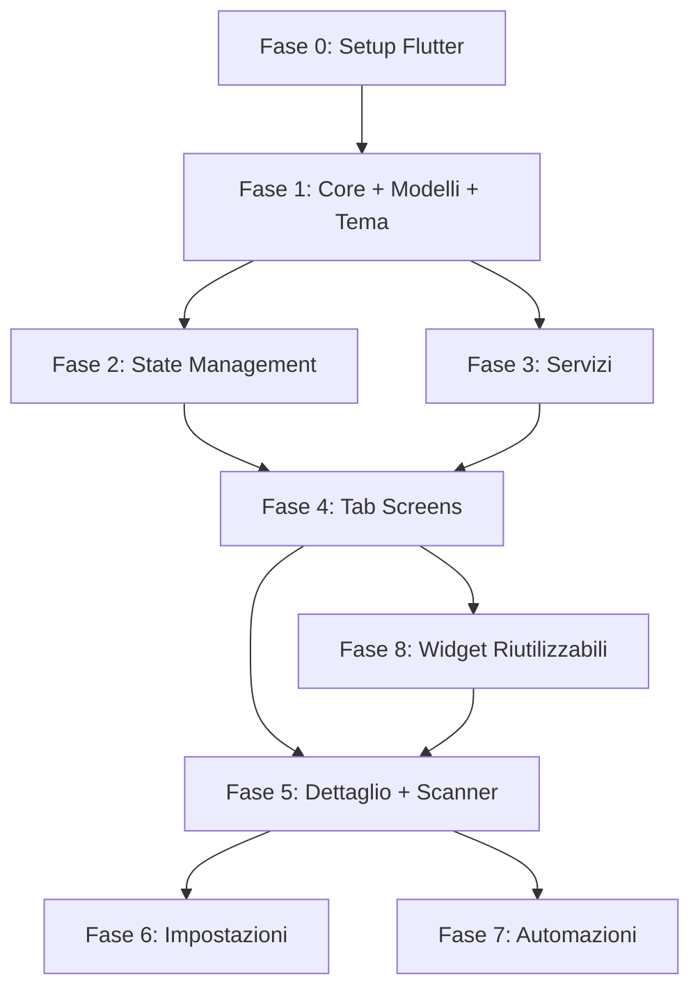

# Migrazione Syncro Flow: da Expo/React Native → Flutter

## Panoramica

L'app **Syncro Flow** (internamente "FurInventory Pro") è un sistema di gestione inventario per pellicce, attualmente sviluppato con **Expo SDK 54 + React Native 0.81 + TypeScript**. L'obiettivo è migrare tutto a **Flutter/Dart**, mantenendo tutte le funzionalità e il design "Luxury Dark" con tema oro (#D4AF37) su sfondo scuro (#0A0A0A).

### Motivazioni della migrazione
- Complessità di build con Expo Go e toolchain React Native
- Hot reload più stabile in Flutter
- Single codebase più semplice da mantenere
- Performance nativa superiore con Dart AOT compilation

---

## User Review Required

> [!IMPORTANT]
> **Nuovo progetto o sovrascrittura?** Il piano prevede di creare un **nuovo progetto Flutter** in una sottocartella (es. `c:\Users\Primo\Desktop\inventory\syncro_flow_flutter\`) mantenendo il progetto Expo intatto come riferimento. Confermi questo approccio o vuoi sovrascrivere la cartella attuale?

> [!IMPORTANT]
> **Supabase**. Il `package.json` include `@supabase/supabase-js` ma non sembra utilizzato attivamente nei context (tutti usano AsyncStorage locale). Vuoi che il progetto Flutter includa comunque il supporto Supabase per sincronizzazione cloud futura?

> [!WARNING]
> **Dati esistenti**. I dati attuali sono salvati in `AsyncStorage`. La migrazione a Flutter userà `shared_preferences` + `sqflite` (SQLite). Non sarà possibile migrare automaticamente i dati da AsyncStorage al nuovo storage Flutter. Dovrai reinserire i dati o esportare/importare via JSON.

---

## Open Questions

> [!IMPORTANT]
> **Target platforms**: Attualmente l'app supporta Android + iOS + Web. Vuoi mantenere il supporto Web anche in Flutter, o concentrarci solo su **Android + iOS**?

> [!IMPORTANT]
> **State management**: In React Native usi 7 Context Provider + Zustand. In Flutter propongo **Riverpod** (moderno, type-safe, eccellente per app complesse). Alternative: Provider (più semplice), BLoC (più strutturato). Hai una preferenza?

> [!NOTE]
> **Flutter version**: Useremo l'ultima versione stabile di Flutter (attualmente 3.x). Assicurati di avere Flutter SDK installato. Posso guidarti nell'installazione se necessario.

---

## Analisi App Attuale

### Schermate e Navigazione

L'app ha una struttura a **5 tab** + schermate modali/push:

| Tab | File | Descrizione | LOC |
|-----|------|-------------|-----|
| 🏠 Home | `(tabs)/index.tsx` | Dashboard con lista prodotti, filtri, statistiche | ~800 |
| ⏱ Cronologia | `(tabs)/timeline.tsx` | Timeline eventi inventario | ~400 |
| ⚡ Automazioni | `(tabs)/automations.tsx` | Lista automazioni personalizzate | ~350 |
| ➕ Aggiungi | `(tabs)/add.tsx` | Form aggiunta prodotto con layout dinamico | ~1500 |
| ⚙ Impostazioni | `(tabs)/settings.tsx` | Configurazioni app | ~500 |

**Schermate Push/Modal** (12 aggiuntive):

| Schermata | File | LOC |
|-----------|------|-----|
| Dettaglio Prodotto | `product/[id].tsx` | ~1900 |
| Scanner Camera | `scanner.tsx` | ~550 |
| Azione Rapida Scanner | `scanner-action.tsx` | ~580 |
| Gestione Posizioni | `settings/locations.tsx` | ~380 |
| Campi Personalizzati | `settings/fields.tsx` | ~850 |
| Gestione Cartelle | `settings/folders.tsx` | ~500 |
| Layout Builder | `settings/layout-builder.tsx` | ~1100 |
| Config GS1 | `settings/gs1-config.tsx` | ~530 |
| Config Hardware | `settings/hardware.tsx` | ~250 |
| Automation Builder | `settings/automation-builder.tsx` | ~830 |
| Template Settore | `settings/sector-templates.tsx` | ~550 |
| Condivisione | `settings/share.tsx` | ~280 |
| Cestino | `settings/trash.tsx` | ~400 |
| Audit Automazione | `automations/audit.tsx` | ~500 |
| Flow Automazione | `automations/automation-flow.tsx` | ~400 |
| Batch Move | `automations/batch-move.tsx` | ~480 |
| Custom Runner | `automations/custom-runner.tsx` | ~740 |
| Quick Tag | `automations/quick-tag.tsx` | ~410 |
| Scan & Sell | `automations/scan-sell.tsx` | ~360 |

### Modelli Dati (da [types/index.ts](file:///c:/Users/Primo/Desktop/inventory/types/index.ts))

```
Product          - 28 campi (id, sku, furType, location, status, images, prezzi, misure, customData, gs1DigitalLink...)
TimelineEvent    - 6 campi (id, productId, type, timestamp, details)
CustomField      - 13 campi (id, name, type, uiType, dataset, options, required, order, isBarcode, linkTo...)
Alert            - 6 campi (id, productId, type, message, dismissed)
Library          - 5 campi (id, name, icon, createdAt, barcode, nfcTag)
```

### State Management (7 Context Providers)

| Context | Responsabilità | Storage |
|---------|---------------|---------|
| `InventoryContext` | Prodotti, timeline, alerts, librerie, CRUD completo | AsyncStorage |
| `CustomFieldsContext` | Campi personalizzati, ordine, soft-delete | AsyncStorage |
| `LocationsContext` | Posizioni fisiche (magazzino, vetrina, stand...) | AsyncStorage |
| `LayoutContext` | Layout configurabile form "Aggiungi" | AsyncStorage |
| `AutomationsContext` | Automazioni personalizzate multi-step | AsyncStorage |
| `GS1ConfigContext` | Configurazione GS1 Digital Link | AsyncStorage |
| `HardwareConfigContext` | Modalità scanner (NFC/QR/entrambi) | AsyncStorage |

### Funzionalità Speciali

| Feature | Dipendenze React Native | Pacchetto Flutter Equivalente |
|---------|--------------------------|-------------------------------|
| Scanner Barcode/QR | `expo-camera` | `mobile_scanner` |
| NFC Read/Write | `react-native-nfc-manager` | `nfc_manager` |
| Suoni/Beep | `expo-av` | `audioplayers` |
| Vibrazione | `react-native Vibration` | `vibration` (built-in) |
| File System | `expo-file-system` | `path_provider` + `dart:io` |
| Image Picker | `expo-image-picker` | `image_picker` |
| Image Manipulation | `expo-image-manipulator` | `image` package |
| Barcode Generation (QR SVG) | `react-native-qrcode-svg` | `qr_flutter` |
| GS1 Digital Link | Custom utils | Porting diretto in Dart |
| Document Picker | `expo-document-picker` | `file_picker` |
| Clipboard | `expo-clipboard` | `clipboard` (built-in Flutter) |
| Secure Storage | `expo-secure-store` | `flutter_secure_storage` |
| Battery Monitor | `expo-battery` | `battery_plus` |
| Network Check | `@react-native-community/netinfo` | `connectivity_plus` |
| Sharing | `expo-sharing` | `share_plus` |
| Print | `expo-print` | `printing` |
| Local Auth (biometrics) | `expo-local-authentication` | `local_auth` |
| Location/GPS | `expo-location` | `geolocator` |
| Splash Screen | `expo-splash-screen` | Configurazione nativa Flutter |
| Bottom Sheet | `@gorhom/bottom-sheet` | `modal_bottom_sheet` o built-in |

---

## Proposed Changes

### Fase 0: Setup Progetto Flutter

#### [NEW] Progetto Flutter `syncro_flow_flutter/`

```
flutter create syncro_flow_flutter --org com.redako35 --project-name syncro_flow
```

Struttura directory proposta:

```
syncro_flow_flutter/
├── lib/
│   ├── main.dart                          # Entry point
│   ├── app.dart                           # MaterialApp con tema e routing
│   │
│   ├── core/                              # Fondamenta
│   │   ├── theme/
│   │   │   ├── app_theme.dart             # Tema luxury dark + oro
│   │   │   ├── app_colors.dart            # Palette colori
│   │   │   └── app_typography.dart         # Stili testo
│   │   ├── constants/
│   │   │   ├── config.dart                # Costanti app
│   │   │   └── sector_templates.dart      # Template settoriali
│   │   └── router/
│   │       └── app_router.dart            # GoRouter navigazione
│   │
│   ├── models/                            # Modelli dati
│   │   ├── product.dart
│   │   ├── timeline_event.dart
│   │   ├── custom_field.dart
│   │   ├── alert.dart
│   │   ├── library.dart
│   │   ├── location.dart
│   │   ├── automation.dart
│   │   ├── layout_config.dart
│   │   ├── gs1_config.dart
│   │   └── hardware_config.dart
│   │
│   ├── providers/                         # State Management (Riverpod)
│   │   ├── inventory_provider.dart
│   │   ├── custom_fields_provider.dart
│   │   ├── locations_provider.dart
│   │   ├── layout_provider.dart
│   │   ├── automations_provider.dart
│   │   ├── gs1_config_provider.dart
│   │   └── hardware_config_provider.dart
│   │
│   ├── services/                          # Servizi (NFC, Sound, Barcode...)
│   │   ├── nfc_service.dart
│   │   ├── sound_service.dart
│   │   ├── barcode_decoder_service.dart
│   │   ├── gs1_service.dart
│   │   └── storage_service.dart
│   │
│   ├── screens/                           # Schermate
│   │   ├── tabs/
│   │   │   ├── home_screen.dart
│   │   │   ├── timeline_screen.dart
│   │   │   ├── automations_screen.dart
│   │   │   ├── add_product_screen.dart
│   │   │   └── settings_screen.dart
│   │   ├── product/
│   │   │   ├── product_detail_screen.dart
│   │   │   └── product_edit_screen.dart
│   │   ├── scanner/
│   │   │   ├── scanner_screen.dart
│   │   │   └── scanner_action_screen.dart
│   │   ├── settings/
│   │   │   ├── locations_screen.dart
│   │   │   ├── fields_screen.dart
│   │   │   ├── folders_screen.dart
│   │   │   ├── layout_builder_screen.dart
│   │   │   ├── gs1_config_screen.dart
│   │   │   ├── hardware_screen.dart
│   │   │   ├── automation_builder_screen.dart
│   │   │   ├── sector_templates_screen.dart
│   │   │   ├── share_screen.dart
│   │   │   └── trash_screen.dart
│   │   └── automations/
│   │       ├── audit_screen.dart
│   │       ├── automation_flow_screen.dart
│   │       ├── batch_move_screen.dart
│   │       ├── custom_runner_screen.dart
│   │       ├── quick_tag_screen.dart
│   │       └── scan_sell_screen.dart
│   │
│   └── widgets/                           # Widget riutilizzabili
│       ├── barcode_widget.dart
│       ├── barcode_scanner_widget.dart
│       ├── dynamic_field_renderer.dart
│       ├── product_card.dart
│       ├── stat_card.dart
│       ├── section_header.dart
│       └── luxury_bottom_sheet.dart
│
├── assets/
│   ├── images/
│   │   └── logo.png
│   └── audio/
│       ├── beep_short.wav
│       └── beep_long.wav
│
├── android/
│   └── app/src/main/AndroidManifest.xml   # Permessi NFC
│
├── ios/
│   └── Runner/Info.plist                  # NFC entitlements
│
└── pubspec.yaml                           # Dipendenze
```

---

### Fase 1: Fondamenta (Core + Modelli + Tema)

#### [NEW] `lib/core/theme/app_colors.dart`
Porting del tema da [theme.ts](file:///c:/Users/Primo/Desktop/inventory/constants/theme.ts):
- Palette luxury dark: background `#0A0A0A`, primary gold `#D4AF37`
- Colori status: success, error, warning, info
- Colori location: warehouse, showcase, workshop, stand

#### [NEW] `lib/core/theme/app_theme.dart`
- `ThemeData` Material 3 con tema dark personalizzato
- Porting di `typography`, `shadows`, `borderRadius`, `spacing`

#### [NEW] `lib/models/*.dart`
Porting 1:1 di tutti i modelli da [types/index.ts](file:///c:/Users/Primo/Desktop/inventory/types/index.ts):
- `Product` con `fromJson()`/`toJson()` per serializzazione
- `CustomField` con enum `FieldType` e `FieldUIType`
- `TimelineEvent`, `Alert`, `Library`, `Location`, `Automation`
- `LayoutConfig`, `GS1Config`, `HardwareConfig`

#### [NEW] `lib/core/constants/config.dart`
Porting da [config.ts](file:///c:/Users/Primo/Desktop/inventory/constants/config.ts):
- `LOCATIONS`, `FUR_TYPES`, `STATUS`, `QUICK_ACTIONS`
- `DORMANT_THRESHOLD_DAYS`, `PROMOTION_THRESHOLD_DAYS`

---

### Fase 2: State Management (Providers → Riverpod)

#### [NEW] `lib/providers/inventory_provider.dart`
Porting da [InventoryContext.tsx](file:///c:/Users/Primo/Desktop/inventory/contexts/InventoryContext.tsx):
- `StateNotifierProvider<InventoryNotifier, InventoryState>`
- CRUD prodotti, timeline, alerts, librerie
- Persistenza con `shared_preferences` (JSON serializzato)
- Generazione SKU automatica
- Alert automatici per prodotti dormienti/promozione

#### [NEW] `lib/providers/custom_fields_provider.dart`
Porting da [CustomFieldsContext.tsx](file:///c:/Users/Primo/Desktop/inventory/contexts/CustomFieldsContext.tsx):
- Campi sistema predefiniti (SKU, Tipo Pelle, Posizione, Prezzi, Misure, Note...)
- CRUD campi custom, soft-delete, riordino, reset defaults

#### [NEW] `lib/providers/locations_provider.dart`
Porting da [LocationsContext.tsx](file:///c:/Users/Primo/Desktop/inventory/contexts/LocationsContext.tsx)

#### [NEW] `lib/providers/layout_provider.dart`
Porting da [LayoutContext.tsx](file:///c:/Users/Primo/Desktop/inventory/contexts/LayoutContext.tsx):
- Layout configurabile per form "Aggiungi Prodotto"
- Sezioni, dimensioni campi, visibilità, ordine drag-and-drop
- Migrazione automatica versioni layout

#### [NEW] `lib/providers/automations_provider.dart`
Porting da [AutomationsContext.tsx](file:///c:/Users/Primo/Desktop/inventory/contexts/AutomationsContext.tsx):
- Automazioni multi-step personalizzate
- Step types: scan_product, scan_location, move_to, mark_sold, add_tag, set_field
- Collegamento QR code → automazione

#### [NEW] `lib/providers/gs1_config_provider.dart` + `lib/providers/hardware_config_provider.dart`
Porting dei rispettivi context

---

### Fase 3: Servizi

#### [NEW] `lib/services/storage_service.dart`
- Wrapper unificato per `shared_preferences` (dati semplici) e `sqflite` (prodotti/timeline se necessario)
- Metodi: `save<T>()`, `load<T>()`, `delete()`, `clear()`

#### [NEW] `lib/services/nfc_service.dart`
Porting da [nfcService.ts](file:///c:/Users/Primo/Desktop/inventory/utils/nfcService.ts):
- `cleanTag()`, `writeGS1Uri()`, `readTag()` usando `nfc_manager` package
- Gestione sessioni NFC per iOS/Android

#### [NEW] `lib/services/sound_service.dart`
Porting da [SoundService.ts](file:///c:/Users/Primo/Desktop/inventory/services/SoundService.ts):
- Caricamento beep WAV 3kHz da assets
- Pattern: success (1 bip), anomaly (3 bip), error (1 lungo), fragile (2 distanziati)...
- Fallback a vibrazione se audio non disponibile

#### [NEW] `lib/services/barcode_decoder_service.dart`
Porting da [barcodeDecoder.ts](file:///c:/Users/Primo/Desktop/inventory/utils/barcodeDecoder.ts):
- Multi-API decode (QRServer + ZXing)
- Preprocessing immagini con variazioni multiple

#### [NEW] `lib/services/gs1_service.dart`
Porting da [gs1.ts](file:///c:/Users/Primo/Desktop/inventory/utils/gs1.ts):
- `generateGS1DigitalLink()`, `validateGTIN()`, `generateSerial()`, `buildPreviewLink()`

---

### Fase 4: Schermate Tab (Core UI)

#### [NEW] `lib/screens/tabs/home_screen.dart`
Porting da [(tabs)/index.tsx](file:///c:/Users/Primo/Desktop/inventory/app/(tabs)/index.tsx):
- Dashboard con statistiche (totale, disponibili, venduti, valore)
- Lista prodotti con filtri (tutti, disponibili, venduti, alert)
- Ricerca full-text
- FAB per scanner/aggiungi

#### [NEW] `lib/screens/tabs/add_product_screen.dart`
Porting da [(tabs)/add.tsx](file:///c:/Users/Primo/Desktop/inventory/app/(tabs)/add.tsx):
- Form dinamico basato su `LayoutConfig`
- Rendering campi custom con `DynamicFieldRenderer`
- Upload foto, picker, date picker, etc.

#### [NEW] `lib/screens/tabs/timeline_screen.dart`
#### [NEW] `lib/screens/tabs/automations_screen.dart`
#### [NEW] `lib/screens/tabs/settings_screen.dart`

---

### Fase 5: Schermate Dettaglio e Scanner

#### [NEW] `lib/screens/product/product_detail_screen.dart`
Porting da [product/[id].tsx](file:///c:/Users/Primo/Desktop/inventory/app/product/[id].tsx) (~1900 LOC):
- Vista dettaglio con hero image, dati prodotto, timeline, azioni rapide
- Azioni: Sposta, Vendi, Modifica, QR/NFC, Elimina

#### [NEW] `lib/screens/scanner/scanner_screen.dart`
- Camera overlay con `mobile_scanner`
- Scan QR/Barcode → lookup prodotto o automazione

#### [NEW] `lib/screens/scanner/scanner_action_screen.dart`
- Azioni post-scan: Sposta, Vendi, Dettagli

---

### Fase 6: Schermate Impostazioni

10 schermate da portare in Flutter — tutte seguono pattern simili:
- Lista editabile (CRUD) con bottom sheet per form
- Persistenza via provider Riverpod

#### [NEW] `lib/screens/settings/locations_screen.dart`
#### [NEW] `lib/screens/settings/fields_screen.dart`
#### [NEW] `lib/screens/settings/folders_screen.dart`
#### [NEW] `lib/screens/settings/layout_builder_screen.dart`
- Drag-and-drop con `ReorderableListView` per ordinare campi
- Toggle visibilità, selezione dimensione (small/medium/full)

#### [NEW] `lib/screens/settings/gs1_config_screen.dart`
#### [NEW] `lib/screens/settings/hardware_screen.dart`
#### [NEW] `lib/screens/settings/automation_builder_screen.dart`
#### [NEW] `lib/screens/settings/sector_templates_screen.dart`
#### [NEW] `lib/screens/settings/share_screen.dart`
#### [NEW] `lib/screens/settings/trash_screen.dart`

---

### Fase 7: Schermate Automazioni

#### [NEW] `lib/screens/automations/audit_screen.dart`
#### [NEW] `lib/screens/automations/automation_flow_screen.dart`
#### [NEW] `lib/screens/automations/batch_move_screen.dart`
#### [NEW] `lib/screens/automations/custom_runner_screen.dart`
#### [NEW] `lib/screens/automations/quick_tag_screen.dart`
#### [NEW] `lib/screens/automations/scan_sell_screen.dart`

---

### Fase 8: Widget Riutilizzabili

#### [NEW] `lib/widgets/dynamic_field_renderer.dart`
Porting da [DynamicFieldRenderer.tsx](file:///c:/Users/Primo/Desktop/inventory/components/DynamicFieldRenderer.tsx) (~1100 LOC):
- Rendering dinamico campi: text, number, currency, date, images, single_choice, multi_choice, document
- UI types: grid, stepper, segmented, text, gps-link, date, images, picker, modal_list, document

#### [NEW] `lib/widgets/barcode_widget.dart` + `barcode_scanner_widget.dart`
#### [NEW] `lib/widgets/product_card.dart`
#### [NEW] `lib/widgets/stat_card.dart`

---

## Dipendenze Flutter (`pubspec.yaml`)

```yaml
dependencies:
  flutter:
    sdk: flutter
  
  # State Management
  flutter_riverpod: ^2.x
  
  # Navigazione
  go_router: ^14.x
  
  # Storage
  shared_preferences: ^2.x
  sqflite: ^2.x
  flutter_secure_storage: ^9.x
  
  # Camera & Scanner
  mobile_scanner: ^5.x
  
  # NFC
  nfc_manager: ^3.x
  
  # Immagini
  image_picker: ^1.x
  image: ^4.x
  cached_network_image: ^3.x
  
  # QR Code Generation
  qr_flutter: ^4.x
  
  # Audio & Haptics
  audioplayers: ^6.x
  
  # File System
  path_provider: ^2.x
  file_picker: ^8.x
  
  # Utilities
  intl: ^0.19.x          # Date formatting
  uuid: ^4.x             # ID generation
  share_plus: ^9.x       # Sharing
  url_launcher: ^6.x     # Open URLs
  connectivity_plus: ^6.x # Network check
  battery_plus: ^6.x     # Battery monitor
  local_auth: ^2.x       # Biometrics
  geolocator: ^12.x      # GPS
  printing: ^5.x         # Stampa
  
  # UI
  google_fonts: ^6.x     # Font Inter
  flutter_slidable: ^3.x # Swipe actions
  animations: ^2.x       # Micro-animations
```

---

## Riepilogo Effort Stimato

| Fase | Descrizione | File | Effort stimato |
|------|-------------|------|----------------|
| 0 | Setup progetto Flutter | ~5 | 1-2 ore |
| 1 | Core (tema, modelli, costanti) | ~15 | 3-4 ore |
| 2 | State Management (7 providers) | ~7 | 4-6 ore |
| 3 | Servizi (NFC, Sound, Barcode, GS1) | ~5 | 3-4 ore |
| 4 | Schermate Tab (5 tab principali) | ~5 | 8-12 ore |
| 5 | Dettaglio Prodotto + Scanner | ~3 | 6-8 ore |
| 6 | Schermate Impostazioni (10) | ~10 | 8-10 ore |
| 7 | Schermate Automazioni (6) | ~6 | 4-6 ore |
| 8 | Widget riutilizzabili | ~6 | 4-6 ore |
| **Totale** | | **~62 file** | **~40-55 ore** |

---

## Verification Plan

### Automated Tests
```bash
# Nella directory Flutter
flutter test                    # Unit tests
flutter analyze                 # Analisi statica
flutter build apk --debug      # Verifica build Android
flutter build ios --no-codesign # Verifica build iOS (se su Mac)
```

### Manual Verification
- **CRUD Prodotti**: Aggiungere, modificare, eliminare, ripristinare prodotto
- **Scanner**: Test scan QR/barcode con camera reale
- **NFC**: Test lettura/scrittura tag NFC (dispositivo fisico)
- **Persistenza**: Chiudi e riapri app → dati persistiti
- **Automazioni**: Creare ed eseguire automazione multi-step
- **Layout Builder**: Personalizzare form e verificare rendering
- **Tema**: Verificare coerenza visiva luxury dark su tutti gli schermi
- **Performance**: Scrolling fluido con lista 100+ prodotti

---

## Ordine di Esecuzione Consigliato



Ti consiglio di procedere in quest'ordine per avere sempre un'app funzionante e testabile ad ogni fase.
